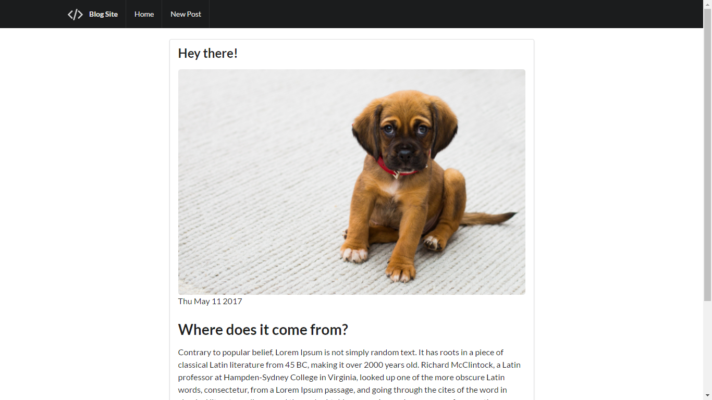
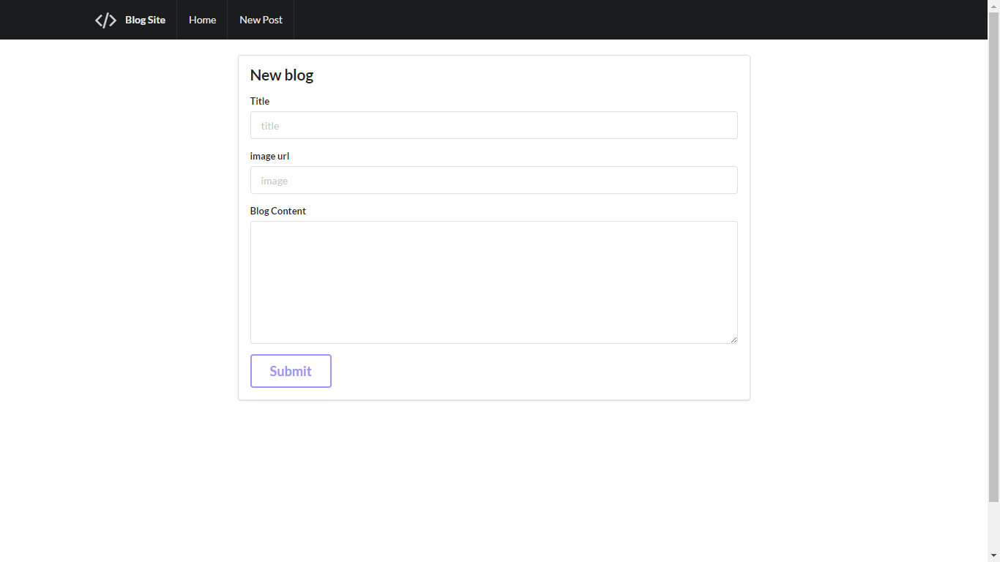
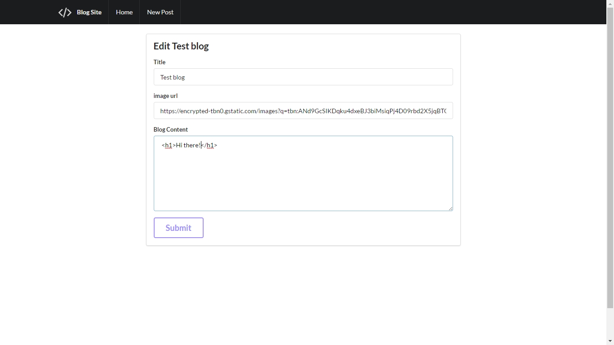
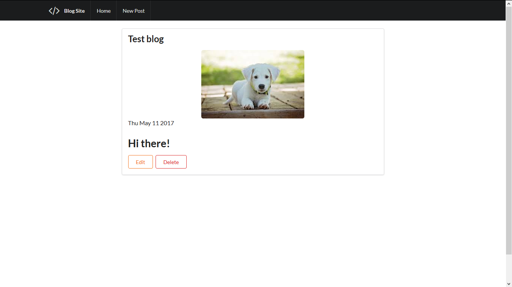
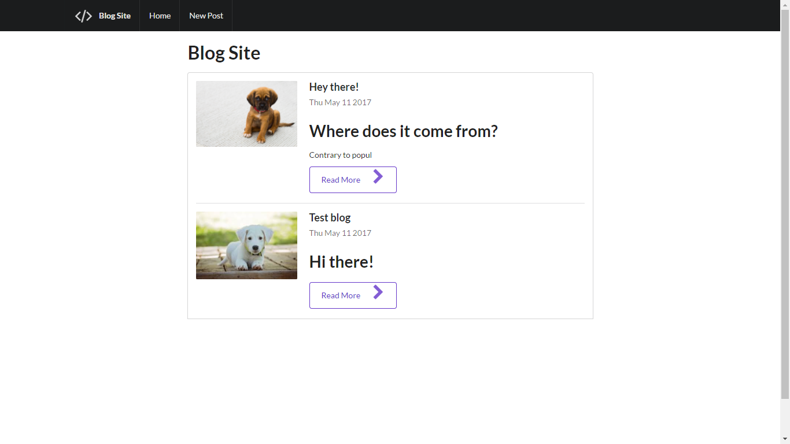

# RESTBlog
**A MEN based REST routes obeying blog**

Prerequisites
-------------
* MongoDB
* nodejs
* npm

Usage
------------
> Clone the repository

> npm install

> Run mongodb daemon

> Provide enviornment variables
  * PORT - PORT
  * IP - IP ADDRESS
  * SECRET - Enter secret at /admin-register for admin signup

> node app.js

Features :
----------
* Admin can : 
    * Add a new blog
    * Update an existing blog
    * Delete a blog
* All users can : 
    * Comment on posts
    * Edit their own comments

TODO : 
======
* Add pagination
* Add email verification
* Add email notifications

Packages/frameworks used :
----
* mongoose
* express
* request
* mongoose
* body-parser
* method-override
* express-sanitizer
* Semantics UI

Images
======

